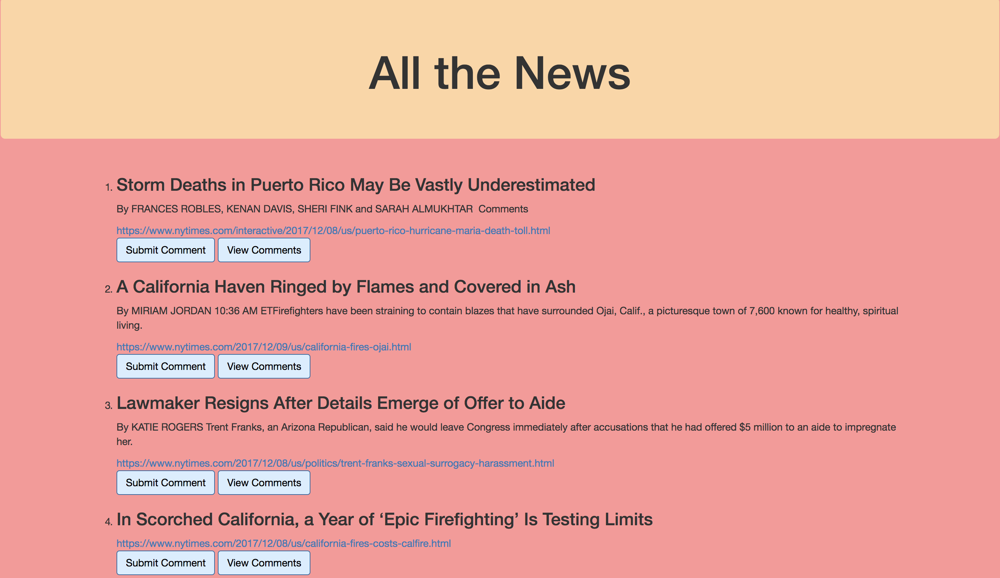

# mongoscraper

An application that will scrape the New York Times front page to get all the articles and display the article title, author, link, and brief summary.

It utilizes MongoDB for the storage of the articles and uses Handlebars.js to render them to the client.

This application is still in the works, comment functionality coming soon.